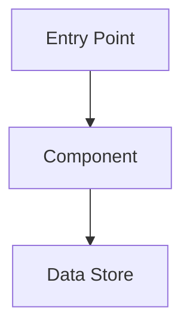
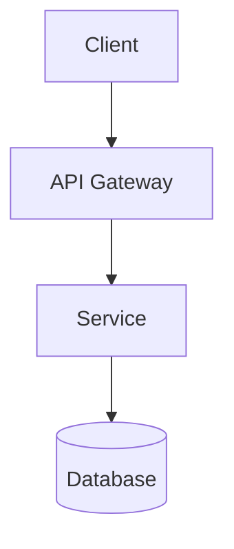
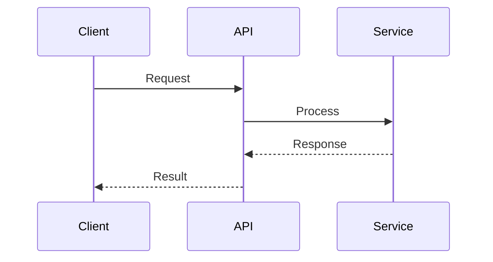

# Describe Design

Research a codebase and produce an architectural document describing how features or
systems work. The output is a markdown file organized for both human readers and
future AI agents.

## Workflow

### Stage 1: Scope Definition

Understand what to document before exploring:

1. Ask what feature, system, or component to document.
2. Clarify the target audience (developers, AI agents, or both).
3. Confirm the codebase location if not obvious from context.

### Stage 2: Initial Exploration

Explore the codebase broadly to build a mental model. Use lightweight, fast exploration
methods when available (in Claude Code, for example, use a Haiku Explore subagent):

1. Scan directory structure and identify key entry points.
2. Read README, config files, and existing documentation.
3. Identify the main files and modules related to the feature.
4. Build a mental model of codebase organization.

Present a high-level outline to the user:

```
## Proposed Outline

1. [Component A] - Brief description
2. [Component B] - Brief description
3. [Component C] - Brief description

* Have I correctly captured the scope of the research? Reply "yes" to continue.
* Otherwise, please let me know what I've misunderstood.
```

When the user confirms the scope, move on to deep research.

### Stage 3: Deep Research

For each component in the approved outline:

1. Trace code paths from entry points.
2. Identify dependencies and interactions between components.
3. Note configuration options and where they're defined.
4. Find where data is stored or persisted.
5. Build a code reference index (file paths + key function/class names).

Try to rely on the initial code exploration for much of this information. Read
additional files as needed. If the scope changed considerably in Stage 2, you
can engage a second code exploration subagent.

#### When to Stop Exploring

**You're ready to draft when you can:**

- **Trace the happy path** — Follow a typical request/action from entry point to
  completion without gaps.
- **Name the boundaries** — Clearly state what's in scope and what's external.
- **Draw the diagram** — Sketch the architecture without placeholder boxes.
- **Answer "what talks to what?"** — For each component, you know its inputs and outputs.

**Signs you're not done:**

- Uncertainty: "I think this connects to..." or "probably calls..."
- Unresolved references: Found imports/calls to modules you haven't examined.
- Missing edges: Can't explain how data gets from component A to B.

**Signs you've gone too far:**

- Reading every file in a directory instead of representative samples.
- Tracing into external libraries or framework internals.
- Exploring implementation details that don't affect architecture.

### Stage 4: Document Draft

Generate the document following the template below. Present the draft to the user
for review and iterate based on feedback. If available, use the AskUserQuestion
tool to request user input on key decisions.

### Stage 5: Finalize

1. **Confirm the file location before writing.** You may propose a path based on repository
   conventions (e.g., `docs/architecture/`, `ARCHITECTURE.md`), but NEVER write the file
   without explicit user confirmation of the location. If the user provided a path upfront,
   that counts as confirmation.
2. Write the final document to the confirmed location.

## Document Template

The following template provides a starting point. Adapt it to fit the feature being
documented — omit sections that don't apply, add sections for unique aspects, and
adjust the structure to best serve the target audience.

````markdown
# [Feature/System Name] Architecture

## Overview

[1-2 paragraph summary of what this feature/system does and why it exists]

## Architecture Diagram



## Components

### [Component Name]

**Purpose**: [What it does]

**Location**: `path/to/file.ext`

**Key Functions**:
- `functionName()` - Brief description
- `anotherFunction()` - Brief description

**Interactions**:
- Receives input from: [Component]
- Sends output to: [Component]

## Data Flow

[Description of how data moves through the system, from input to output]

## Configuration

[How features are enabled, disabled, or configured. Include file paths and
environment variables.]

## Code References

| Component | File | Key Symbols |
|-----------|------|-------------|
| Auth | `src/auth/index.ts` | `authenticate()`, `AuthConfig` |
| Cache | `src/cache/redis.ts` | `CacheManager`, `invalidate()` |

## Glossary

| Term | Definition |
|------|------------|
| [Term] | [Project-specific definition] |
````

## Code Reference Conventions

Use stable references that survive refactoring:

- **Paths**: Use relative paths from repository root (`src/auth/login.ts`)
- **Symbols**: Reference function and class names, not line numbers
- **Format**: `path/to/file.ext` with key symbols listed separately
- **Anchors**: Use search patterns when helpful (`handleAuth function in auth/`)

Avoid:

- **Copying code**: Never paste code into the document. Code goes stale immediately;
  the document should be a guide that points readers to the source. Describe what
  code does, then reference where to find it.
- **Line numbers**: They change with every edit.
- **Absolute paths**: Use repository-relative paths only.

## Mermaid Diagrams

Use Mermaid for architecture visualizations:

**Flowcharts** for component relationships:


**Sequence diagrams** for request flows:


Keep diagrams focused on the specific feature being documented. Avoid overcrowding
with unrelated components.

## Writing Guidelines

- **Describe, never copy**: Explain what code does and where to find it. Readers who
  need implementation details will read the actual source — which is always current.
- **Structure for scanning**: Use headers, tables, and lists for quick navigation.
- **Be specific**: Include actual file paths, function names, and config keys.
- **Serve two audiences**: Write clearly for humans; use consistent structure for AI.
- **Stay current**: Note any assumptions about code state or version.
